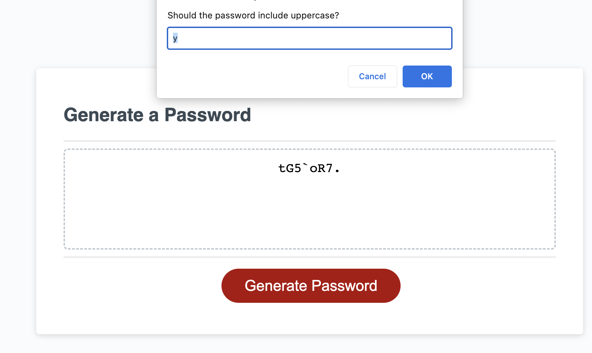

# PASSWORD-GENERATOR
Password Generator for challenge 3

## INSTALLATION AND UPDATES MADE:
1. The page was built using mainly Javascript, HTML5 and CSS3, deployed using Github pages and is hostested on Github. Link and the screen shot are attached herewith.

a) 
b) link to github pages (https://github.com/druharo/Password-Generator)
c) Link to the live site (https://druharo.github.io/Password-Generator/)

2. Key changes were made and pushed to github repository. initial  commit, update to the Javascript code, inserting images, updating the URLs and creation of page in Github.

3. A number of challenges were encountered during the development of the site especially with allocating a randomizer. 

## MOTIVATION:
The main motivation of the site is to can create a strong password that provides greater security using numbers, lowercase, uppercase and special characters. 

## LICENSES:
The code has an MIT License.

## CREDITS:
UMN Bootcamp Tutoring Staff and www.w3schools.com.

